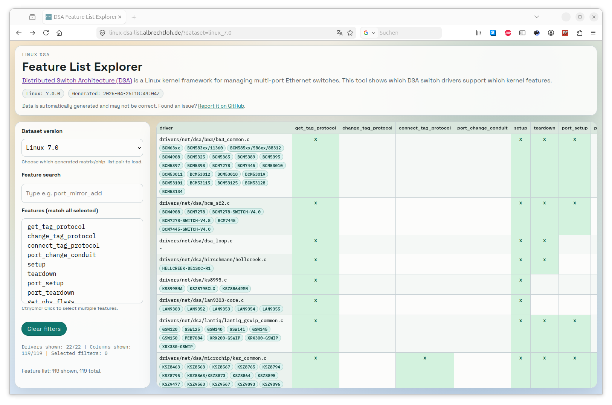

# linux-dsa-list

This repository provides a toolset for getting an overview of Linux DSA
support: which DSA features are implemented by each driver, and which chips are
handled by those drivers. It includes the parser scripts used to build the
datasets, the generated versioned CSV reports, and a static browser viewer for
exploring Linux and OpenWrt DSA support.

Hosted viewer: https://linux-dsa-list.albrechtloh.de/



The feature-matrix generator builds the driver-feature overview by parsing:

- `linux/include/net/dsa.h` for `struct dsa_switch_ops` feature definitions
- `linux/drivers/net/dsa/**/*.c` for driver `dsa_switch_ops` initializers

Optionally, include OpenWrt kernel patch-based DSA drivers and mark them with
an `openwrt:` prefix in the matrix.

Microchip BSP tags from `microchip-ung/linux` are processed as full Linux
kernel trees and generated into dedicated versioned files with a
`microchip-ung` source label in the filename.

The generator marks a feature as supported (`x`) when a driver initializes the
corresponding callback in its `struct dsa_switch_ops` initializer.

The repository also includes a second generator that consumes the transposed
feature matrix and writes one chip-list row per driver, so the resulting data
shows both driver capabilities and driver-to-chip coverage.

## Generator

Script:

- `scripts/generate_dsa_feature_matrix.py`
- `scripts/generate_dsa_driver_chip_list.py`

The script uses Python standard-library parsing only (no shell commands invoked
inside the Python code).

## Usage

Create and use a virtual environment in the repository root:

```bash
python -m venv .venv
source .venv/bin/activate
```

From repository root:

```bash
python scripts/generate_dsa_feature_matrix.py \
	--linux-root linux \
	--out dsa_feature_matrix.csv \
	--column-mode relative
```

### Default output (drivers as rows)

```bash
python scripts/generate_dsa_feature_matrix.py \
	--linux-root linux \
	--out dsa_feature_matrix.csv \
	--column-mode relative
```

### Include OpenWrt-patched and OpenWrt-only DSA drivers

```bash
python scripts/generate_dsa_feature_matrix.py \
	--linux-root linux \
	--include-openwrt \
	--openwrt-root openwrt \
	--out dsa_feature_matrix_openwrt.csv \
	--column-mode relative
```

### Generate a chip-list CSV per driver

The chip-list generator expects a transposed input CSV whose first column is
`driver`, like `dsa_feature_matrix.csv` in this repository.

```bash
python scripts/generate_dsa_driver_chip_list.py \
	--input-csv dsa_feature_matrix.csv \
	--linux-root linux \
	--openwrt-root openwrt \
	--out dsa_driver_chip_list.csv
```

It resolves each driver row back to Linux or OpenWrt source files and extracts
chip names from chip tables, device-tree match tables, bus-specific device IDs,
and chip-ID macros. The output schema is:

```text
driver,chips
```

The `chips` field is a single CSV cell containing a delimiter-separated list of
chip names.

### Generate per-version matrix and chip-list files (6.8 to 7.0)

Use the wrapper script to download Linux source archives, generate one feature
matrix CSV and one driver chip-list CSV per minor line from 6.8 through 7.0,
and clean up extracted source trees.

```bash
scripts/generate_dsa_versioned_reports.sh
```

By default, generated files are written to:

```text
data/dsa_feature_matrix_linux_<version>.csv
data/dsa_driver_chip_list_linux_<version>.csv
```

For Microchip BSP tag mode, generated files are written to:

```text
data/dsa_feature_matrix_microchip-ung_<tag>.csv
data/dsa_driver_chip_list_microchip-ung_<tag>.csv
```

Examples:

```bash
# Generate drivers-as-rows matrix output for each version
scripts/generate_dsa_versioned_reports.sh --output-dir ./data

# Process only a specific kernel version
scripts/generate_dsa_versioned_reports.sh --version 6.8 --output-dir ./data

# Process versions from 6.10 through 6.15
scripts/generate_dsa_versioned_reports.sh --from 6.10 --to 6.15 --output-dir ./data

# Keep output in a custom directory
scripts/generate_dsa_versioned_reports.sh --output-dir ./data

# Delete downloaded archives after each run
scripts/generate_dsa_versioned_reports.sh --no-cache --output-dir ./data

# Pass unresolved-row warnings to chip-list generation
scripts/generate_dsa_versioned_reports.sh --warn-unresolved-chips --output-dir ./data
```

### Generate per-release-line files for OpenWrt stable versions (23.05 to latest)

Use the same wrapper script in OpenWrt release mode. It discovers stable
OpenWrt release lines from the official releases index, downloads the matching
`openwrt-<release_line>` source branch, detects its kernel line, and generates
combined Linux+OpenWrt reports.

```bash
# Process OpenWrt stable release lines from 23.05 to latest stable
scripts/generate_dsa_versioned_reports.sh \
	--openwrt-releases \
	--openwrt-from 23.05 \
	--openwrt-to latest \
	--output-dir ./data

# Process only one OpenWrt release line
scripts/generate_dsa_versioned_reports.sh \
	--openwrt-releases \
	--openwrt-from 23.05 \
	--openwrt-to 23.05 \
	--output-dir ./data

# Include unresolved-chip warnings in OpenWrt mode
scripts/generate_dsa_versioned_reports.sh \
	--openwrt-releases \
	--openwrt-from 23.05 \
	--openwrt-to latest \
	--warn-unresolved-chips \
	--output-dir ./data
```

### Generate per-tag files for Microchip BSP releases (bsp-6.6-2024.12 to latest)

Use `--microchip-releases` to download and process tags from
`microchip-ung/linux`. These archives are full Linux kernel trees, so the
Linux parser path is used directly.

```bash
# Process Microchip BSP tags from bsp-6.6-2024.12 to latest
scripts/generate_dsa_versioned_reports.sh \
	--microchip-releases \
	--output-dir ./data

# Process an explicit Microchip BSP tag range
scripts/generate_dsa_versioned_reports.sh \
	--microchip-releases \
	--microchip-from bsp-6.6-2024.12 \
	--microchip-to bsp-6.18-2026.03 \
	--output-dir ./data

# Process exactly one Microchip BSP tag
scripts/generate_dsa_versioned_reports.sh \
	--microchip-releases \
	--microchip-from bsp-6.12-2025.12 \
	--microchip-to bsp-6.12-2025.12 \
	--output-dir ./data
```

### Generate reports for OpenWrt main (unstable/snapshot) branch

Use `--openwrt-snapshot` to download and process the `main` branch of the
OpenWrt repository. Outputs are written with the `snapshot` suffix.

```bash
# Process OpenWrt main branch (drivers as rows)
scripts/generate_dsa_versioned_reports.sh \
	--openwrt-snapshot \
	--output-dir ./data

# Delete the downloaded snapshot archive after the run (always fresh on next run)
scripts/generate_dsa_versioned_reports.sh \
	--openwrt-snapshot \
	--no-cache \
	--output-dir ./data
```

## Browser Viewer

The repository includes a static browser-only viewer at `web/index.html`.
It loads both CSV files in the browser and renders a filterable driver-feature
matrix with an additional chips column.

### What it does

- consumes `dsa_feature_matrix.csv` (drivers as rows)
- consumes `dsa_driver_chip_list.csv` (chips per driver)
- joins both by the `driver` column
- supports feature filters (multi-select, match all selected features)
- keeps all data processing in client-side JavaScript (no backend)

### Run locally

From repository root:

```bash
python -m http.server 8000
```

Then open:

- `http://localhost:8000/web/`

The viewer first tries to load CSV files from repository root:

- `../dsa_feature_matrix.csv`
- `../dsa_driver_chip_list.csv`

For versioned datasets, the viewer reads `data/datasets.json` first and only
falls back to HTML directory listing when no manifest is present. This avoids
web-server-specific directory index requirements such as nginx `autoindex on`.

### Update workflow

1. Regenerate or replace `dsa_feature_matrix.csv`.
2. Regenerate or replace `dsa_driver_chip_list.csv`.
3. Regenerate `data/datasets.json` if you changed versioned files manually:

```bash
python scripts/generate_web_dataset_manifest.py --data-dir ./data
```

4. Refresh the browser page.

No HTML/JavaScript code changes are required if the CSV schema remains:

- feature matrix header starts with `driver`
- chip list header is `driver,chips`
- support cells are `x` (supported) or empty

## Arguments

- `--linux-root`: path to Linux source tree root (default: `./linux`)
- `--out`: output CSV path (default: `./dsa_feature_matrix.csv`)
- `--column-mode`: naming scheme for driver columns
	- `relative`: `drivers/net/dsa/...` path
	- `basename`: filename only
	- `ops-symbol`: `relative_path:ops_symbol`
- `--warn-unknown-designators`: report initializer designators not found in
	`struct dsa_switch_ops`
- `--include-openwrt`: include OpenWrt DSA drivers parsed from OpenWrt kernel
	patches under `target/linux`
- `--openwrt-root`: path to OpenWrt source tree root (default: `./openwrt`)
- `--openwrt-exclude-do-not-submit`: exclude patch files containing
	`DO-NOT-SUBMIT` in filename

Chip-list generator arguments:

- `--input-csv`: transposed driver-first feature matrix to consume
- `--linux-root`: path to Linux source tree root (default: `./linux`)
- `--openwrt-root`: path to OpenWrt source tree root (default: `./openwrt`)
- `--out`: output CSV path (default: `./dsa_driver_chip_list.csv`)
- `--chip-delimiter`: delimiter used inside the `chips` field
- `--warn-unresolved`: print warnings for unresolved or ambiguous rows

Versioned wrapper script arguments:

- `--version`: process only one Linux kernel version
- `--from`: Linux start version (e.g. `6.8`)
- `--to`: Linux end version (e.g. `7.0`)
- `--openwrt-releases`: switch to OpenWrt stable release-line mode
- `--openwrt-from`: OpenWrt start release line (default: `23.05`)
- `--openwrt-to`: OpenWrt end release line or `latest` (default: `latest`)
- `--openwrt-snapshot`: process the OpenWrt `main` (unstable) branch
- `--microchip-releases`: switch to Microchip BSP tag mode
- `--microchip-from`: Microchip BSP start tag (default: `bsp-6.6-2024.12`)
- `--microchip-to`: Microchip BSP end tag or `latest` (default: `latest`)
- `--output-dir`: output directory for generated CSV files (default: `./data`)
- `--cache-dir`: archive cache directory (default: `./.cache/kernel-archives`)
- `--no-cache`: delete downloaded archives after each successful run
- `--stop-on-error`: stop immediately after the first failed version
- `--warn-unresolved-chips`: pass unresolved warnings to chip-list generation
- `--chip-delimiter`: delimiter used inside the chip list cell

## Disclaimer

This code was generated with AI assistance.
